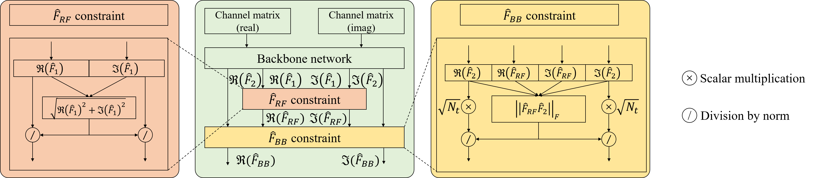
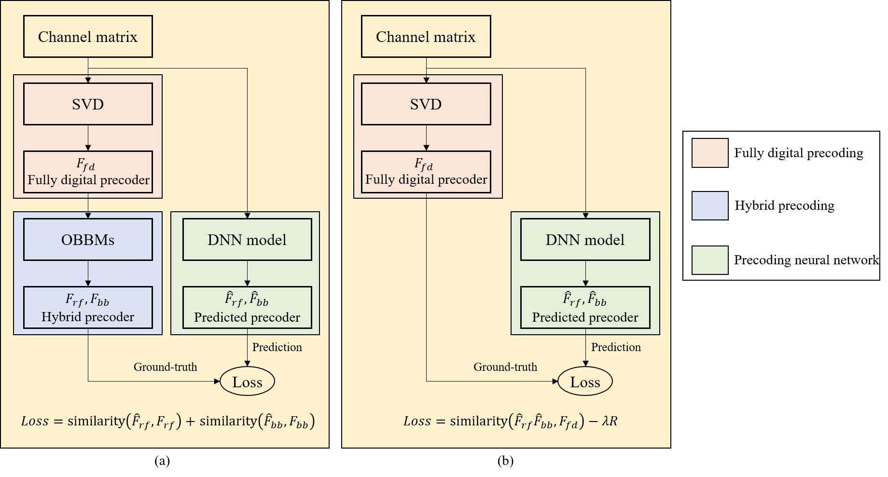
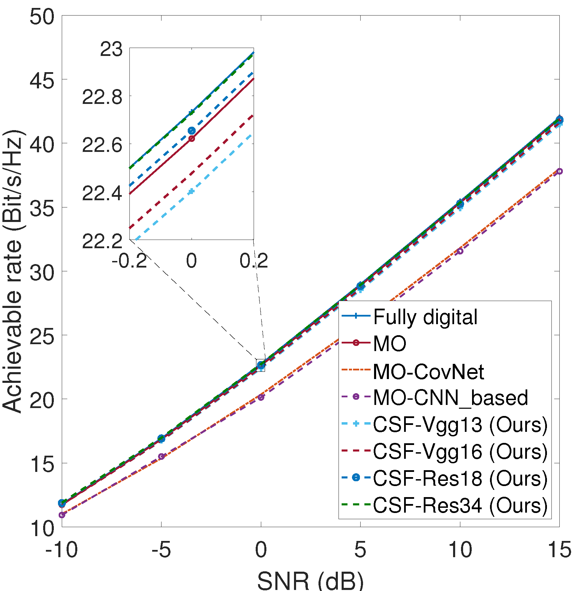
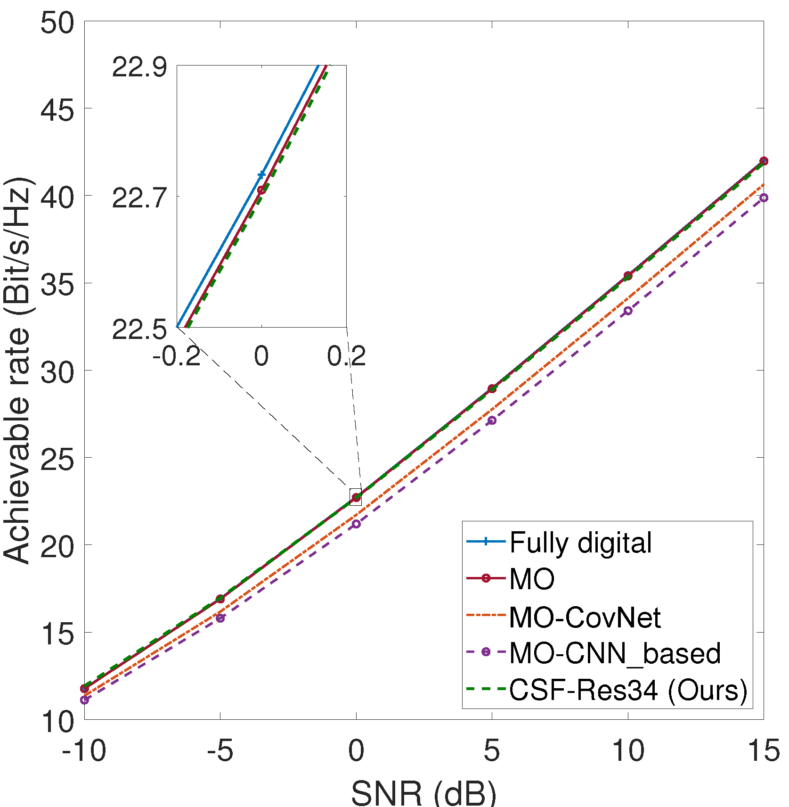

# mmWave_Precoding
The official source code of paper "A Deep Constrained and Synchronous Training Framework for Hybrid Precoding"

Network architecture

Network comparison between previous precoding neural network and our proposed network

Experimental results

 
